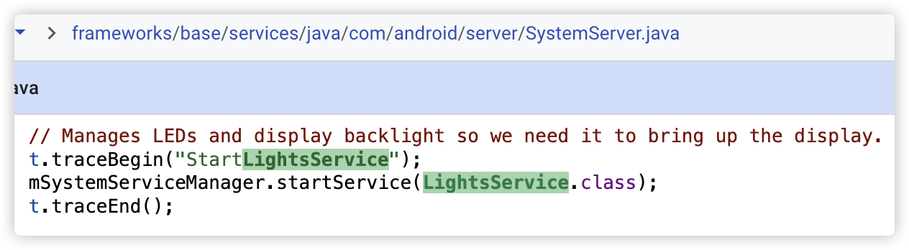
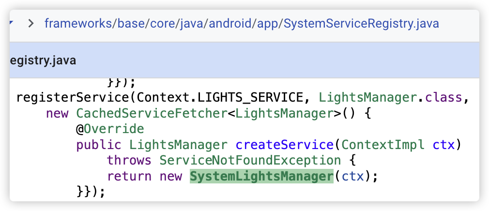

# Light

## LightsService

1 Service side:

2 启动 LightsService

3 注册一个 LightsManager, LightsManager 实质是 Client side 接口的一层封装, 好方便普通 App 访问 LightsService.

Note: 普通 App 可以通过 context.getSystemService() 获取 LightsManager 实例, 主要优点是确保每个 Manager 在同一个 `Context` 中只创建一次，减少系统资源消耗。

4 client side

## Light HAL

xxxxxxx